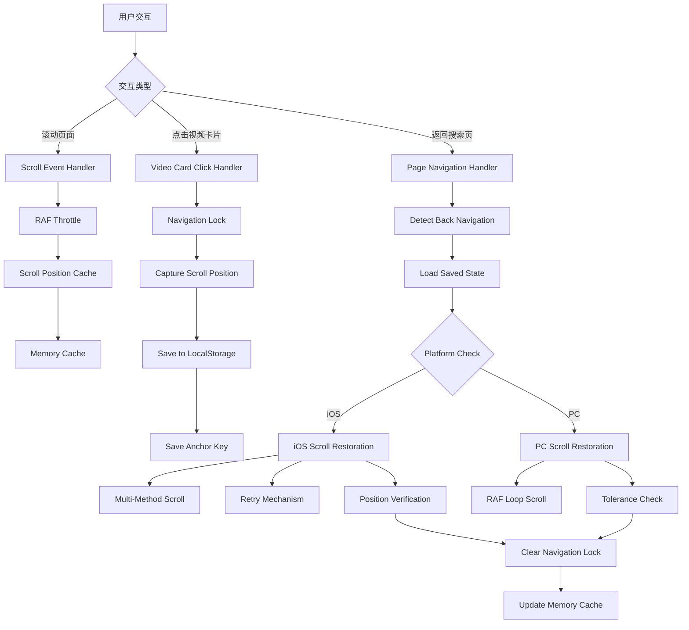

# Design Document

## Overview

本设计文档描述了搜索页滚动位置恢复功能的优化方案。该方案通过改进现有的滚动位置保存和恢复机制，特别针对 iOS Safari 的兼容性问题，提供更流畅、更准确的用户体验。

核心优化策略包括：

1. **双层缓存机制** - 内存缓存 + LocalStorage 持久化
2. **平台特定优化** - iOS 和 PC 端使用不同的滚动策略
3. **智能重试机制** - 自适应重试次数和间隔
4. **锚点辅助定位** - 结合 DOM 元素定位和数值位置
5. **导航锁保护** - 防止跳转过程中的错误覆盖
6. **多方法兼容** - 使用多种 API 确保跨浏览器兼容性
7. **性能优化** - 使用 RAF 和节流减少性能开销
8. **边界情况处理** - 完善的错误处理和降级策略

## Architecture

### 系统架构图



````

### 数据流

1. **滚动捕获阶段**：用户滚动 → RAF 节流 → 更新内存缓存 → 定期保存到 LocalStorage
2. **点击跳转阶段**：点击视频卡片 → 设置导航锁 → 捕获精确位置 → 保存状态和锚点
3. **返回恢复阶段**：检测返回导航 → 加载保存状态 → 平台检测 → 执行恢复策略 → 验证位置 → 清除导航锁

## Components and Interfaces

### 1. Scroll Position Manager（滚动位置管理器）

**职责**：统一管理滚动位置的获取、保存和恢复

**接口定义**：

```typescript
interface ScrollPositionManager {
  /**
   * 获取当前滚动位置（使用多种方法确保准确性）
   */
  getCurrentScrollPosition(): number;

  /**
   * 设置滚动位置
   * @param position 目标滚动位置
   * @param options 滚动选项
   */
  setScrollPosition(position: number, options?: ScrollOptions): void;

  /**
   * 保存滚动位置到缓存和存储
   * @param position 滚动位置
   * @param anchorKey 可选的锚点标识
   */
  saveScrollPosition(position: number, anchorKey?: string): void;

  /**
   * 从存储恢复滚动位置
   */
  restoreScrollPosition(): Promise<void>;

  /**
   * 清除保存的滚动位置
   */
  clearScrollPosition(): void;
}

interface ScrollOptions {
  behavior?: 'auto' | 'smooth';
  platform?: 'ios' | 'pc';
  useAnchor?: boolean;
  anchorKey?: string;
}

interface SavedScrollState {
  scrollPosition: number;
  anchorKey?: string;
  viewMode: 'agg' | 'all';
  query: string;
  timestamp: number;
}
````

### 2. Platform Detector（平台检测器）

**职责**：检测用户的浏览器平台和设备类型

**接口定义**：

```typescript
interface PlatformDetector {
  /**
   * 检测是否为 iOS 设备
   */
  isIOS(): boolean;

  /**
   * 检测是否为 Safari 浏览器
   */
  isSafari(): boolean;

  /**
   * 获取平台类型
   */
  getPlatform(): 'ios' | 'android' | 'pc';

  /**
   * 检测是否支持特定 API
   */
  supportsAPI(apiName: string): boolean;
}

// 实现示例
function isIOS(): boolean {
  const userAgent =
    navigator.userAgent || navigator.vendor || (window as any).opera;
  return /iPad|iPhone|iPod/.test(userAgent) && !(window as any).MSStream;
}
```

### 3. iOS Scroll Restorer（iOS 滚动恢复器）

**职责**：专门处理 iOS Safari 的滚动位置恢复

**核心策略**：

```typescript
interface IOSScrollRestorer {
  /**
   * iOS 专用滚动恢复
   * @param targetPosition 目标滚动位置
   * @param anchorKey 可选的锚点标识
   */
  restore(targetPosition: number, anchorKey?: string): Promise<boolean>;

  /**
   * 验证滚动位置是否正确
   * @param targetPosition 目标位置
   * @param tolerance 容差范围
   */
  verifyPosition(targetPosition: number, tolerance: number): boolean;

  /**
   * 重试滚动恢复
   * @param targetPosition 目标位置
   * @param maxRetries 最大重试次数
   */
  retryRestore(targetPosition: number, maxRetries: number): Promise<boolean>;
}

// iOS 滚动恢复算法
async function restoreIOS(
  targetPosition: number,
  anchorKey?: string
): Promise<boolean> {
  // 1. 移除焦点避免干扰
  if (document.activeElement instanceof HTMLElement) {
    document.activeElement.blur();
  }

  // 2. 尝试锚点定位（如果有）
  let didAnchorScroll = false;
  if (anchorKey) {
    const anchorEl = document.querySelector(
      `[data-search-key="${anchorKey}"]`
    ) as HTMLElement | null;
    if (anchorEl) {
      anchorEl.scrollIntoView({ block: 'start', behavior: 'auto' });
      didAnchorScroll = true;
    }
  }

  // 3. 精确数值滚动（如果没有锚点或需要微调）
  if (!didAnchorScroll) {
    // 使用多种方法确保滚动成功
    window.scrollTo({ top: targetPosition, behavior: 'auto' });
    if (document.body) document.body.scrollTop = targetPosition;
    if (document.documentElement)
      document.documentElement.scrollTop = targetPosition;
  }

  // 4. 延迟验证
  await new Promise((resolve) => setTimeout(resolve, 150));

  // 5. 验证并重试
  const currentPos = getCurrentScrollPosition();
  const diff = Math.abs(currentPos - targetPosition);

  if (diff > 10) {
    // 需要重试
    return await retryRestore(targetPosition, 5);
  }

  return true;
}

// 重试机制
async function retryRestore(
  targetPosition: number,
  maxRetries: number
): Promise<boolean> {
  for (let i = 0; i < maxRetries; i++) {
    // 多种方法强制滚动
    window.scrollTo(0, targetPosition);
    if (document.body) document.body.scrollTop = targetPosition;
    if (document.documentElement)
      document.documentElement.scrollTop = targetPosition;

    // 使用 RAF 确保在下一帧执行
    await new Promise((resolve) => requestAnimationFrame(resolve));

    // 验证
    const currentPos = getCurrentScrollPosition();
    const diff = Math.abs(currentPos - targetPosition);

    if (diff <= 10) {
      return true;
    }

    // 等待后重试
    await new Promise((resolve) => setTimeout(resolve, 100));
  }

  return false;
}
```

### 4. PC Scroll Restorer（PC 滚动恢复器）

**职责**：处理 PC 端的滚动位置恢复

**核心策略**：

```typescript
interface PCScrollRestorer {
  /**
   * PC 专用滚动恢复
   * @param targetPosition 目标滚动位置
   */
  restore(targetPosition: number): Promise<boolean>;
}

// PC 滚动恢复算法（使用 RAF 循环）
async function restorePC(targetPosition: number): Promise<boolean> {
  const scrollingElement =
    document.scrollingElement || document.documentElement || document.body;

  const maxAttempts = 40;
  const tolerance = 8;
  let attempts = 0;

  return new Promise((resolve) => {
    const tryScroll = () => {
      // 设置滚动位置
      if (scrollingElement) {
        scrollingElement.scrollTop = targetPosition;
      }
      window.scrollTo(0, targetPosition);
      if (document.documentElement) {
        document.documentElement.scrollTop = targetPosition;
      }
      if (document.body) {
        document.body.scrollTop = targetPosition;
      }

      // 验证
      const current = scrollingElement
        ? scrollingElement.scrollTop
        : window.scrollY;

      if (Math.abs(current - targetPosition) <= tolerance) {
        resolve(true);
        return;
      }

      attempts++;
      if (attempts >= maxAttempts) {
        // 最后尝试
        setTimeout(() => {
          window.scrollTo(0, targetPosition);
          resolve(false);
        }, 120);
        return;
      }

      requestAnimationFrame(tryScroll);
    };

    if (document.readyState === 'complete') {
      requestAnimationFrame(tryScroll);
    } else {
      window.addEventListener('load', () => {
        requestAnimationFrame(tryScroll);
      });
    }
  });
}
```

### 5. Navigation Lock Manager（导航锁管理器）

**职责**：管理导航锁，防止跳转过程中的错误覆盖

**接口定义**：

```typescript
interface NavigationLockManager {
  /**
   * 设置导航锁
   * @param scrollPosition 锁定时的滚动位置
   */
  lock(scrollPosition: number): void;

  /**
   * 释放导航锁
   */
  unlock(): void;

  /**
   * 检查是否已锁定
   */
  isLocked(): boolean;

  /**
   * 获取锁定的滚动位置
   */
  getLockedPosition(): number | null;
}

// 实现
class NavigationLockManagerImpl implements NavigationLockManager {
  private lockState: {
    active: boolean;
    position: number;
    timestamp: number;
  } | null = null;

  lock(scrollPosition: number): void {
    this.lockState = {
      active: true,
      position: scrollPosition,
      timestamp: Date.now(),
    };

    // 存储到全局对象供其他组件访问
    (window as any).__SEARCH_NAV_LOCK__ = this.lockState;

    console.log('[导航锁] 已设置', this.lockState);
  }

  unlock(): void {
    if (this.lockState) {
      console.log('[导航锁] 已释放', this.lockState);
      this.lockState = null;
      (window as any).__SEARCH_NAV_LOCK__ = { active: false };
    }
  }

  isLocked(): boolean {
    return this.lockState?.active ?? false;
  }

  getLockedPosition(): number | null {
    return this.lockState?.position ?? null;
  }
}
```

### 6. Scroll Position Cache（滚动位置缓存）

**职责**：实时缓存滚动位置，确保点击时能获取准确值

**接口定义**：

```typescript
interface ScrollPositionCache {
  /**
   * 更新缓存的滚动位置
   * @param position 当前滚动位置
   */
  update(position: number): void;

  /**
   * 获取缓存的滚动位置
   */
  get(): number;

  /**
   * 清除缓存
   */
  clear(): void;
}

// 实现（使用 RAF 节流）
class ScrollPositionCacheImpl implements ScrollPositionCache {
  private cachedPosition: number = 0;
  private rafId: number | null = null;
  private lastUpdateTime: number = 0;
  private updateInterval: number;

  constructor(isIOS: boolean) {
    // iOS 降低更新频率
    this.updateInterval = isIOS ? 200 : 100;
    this.startListening();
  }

  private startListening(): void {
    let ticking = false;

    const onScroll = () => {
      if (!ticking) {
        ticking = true;
        this.rafId = requestAnimationFrame(() => {
          const now = Date.now();

          // 立即更新缓存
          const currentPos = this.getCurrentScrollPosition();
          this.cachedPosition = currentPos;

          // 限制保存频率
          if (now - this.lastUpdateTime >= this.updateInterval) {
            this.saveToStorage(currentPos);
            this.lastUpdateTime = now;
          }

          ticking = false;
        });
      }
    };

    window.addEventListener('scroll', onScroll, { passive: true });
  }

  private getCurrentScrollPosition(): number {
    const methods = [
      () => window.scrollY,
      () => document.documentElement?.scrollTop || 0,
      () => document.body?.scrollTop || 0,
      () => document.scrollingElement?.scrollTop || 0,
    ];

    // 找到第一个非零值
    for (const method of methods) {
      try {
        const value = method();
        if (value > 0) return value;
      } catch (e) {
        continue;
      }
    }

    // 如果都是0，返回最大值
    return Math.max(
      ...methods.map((m) => {
        try {
          return m();
        } catch {
          return 0;
        }
      })
    );
  }

  private saveToStorage(position: number): void {
    // 检查导航锁
    const navLock = (window as any).__SEARCH_NAV_LOCK__;
    if (navLock?.active) {
      return;
    }

    // 小值回写保护
    try {
      const saved = localStorage.getItem('searchPageState');
      if (saved) {
        const parsed = JSON.parse(saved);
        const prevPosition = parsed.scrollPosition || 0;

        // 如果当前值很小且之前有大值，忽略
        if (
          prevPosition > 0 &&
          position > 0 &&
          position < 200 &&
          prevPosition > position + 200
        ) {
          return;
        }
      }

      // 更新存储
      const state = saved ? JSON.parse(saved) : {};
      state.scrollPosition = position;
      state.timestamp = Date.now();
      localStorage.setItem('searchPageState', JSON.stringify(state));
    } catch (e) {
      // 静默处理错误
    }
  }

  update(position: number): void {
    this.cachedPosition = position;
  }

  get(): number {
    return this.cachedPosition;
  }

  clear(): void {
    this.cachedPosition = 0;
    if (this.rafId !== null) {
      cancelAnimationFrame(this.rafId);
      this.rafId = null;
    }
  }
}
```

## Data Models

### 1. Saved Scroll State

```typescript
interface SavedScrollState {
  // 滚动位置
  scrollPosition: number;

  // 锚点标识（用于辅助定位）
  anchorKey?: string;

  // 搜索查询
  query: string;

  // 搜索结果
  results: SearchResult[];

  // 是否显示结果
  showResults: boolean;

  // 视图模式
  viewMode: 'agg' | 'all';

  // 选择的资源
  selectedResources: string[];

  // 保存时间戳
  timestamp: number;
}
```

### 2. Navigation Lock State

```typescript
interface NavigationLockState {
  // 是否激活
  active: boolean;

  // 锁定的滚动位置
  position: number;

  // 锁定时间戳
  timestamp: number;

  // 锚点标识
  anchorKey?: string;
}
```

### 3. Scroll Restoration Config

```typescript
interface ScrollRestorationConfig {
  // 平台类型
  platform: 'ios' | 'pc';

  // 最大重试次数
  maxRetries: number;

  // 重试间隔（毫秒）
  retryInterval: number;

  // 位置容差（像素）
  tolerance: number;

  // 是否启用锚点定位
  useAnchor: boolean;

  // 是否启用调试日志
  debug: boolean;

  // 更新频率（毫秒）
  updateInterval: number;
}

// 默认配置
const DEFAULT_CONFIG: Record<'ios' | 'pc', ScrollRestorationConfig> = {
  ios: {
    platform: 'ios',
    maxRetries: 5,
    retryInterval: 100,
    tolerance: 10,
    useAnchor: true,
    debug: false,
    updateInterval: 200,
  },
  pc: {
    platform: 'pc',
    maxRetries: 40,
    retryInterval: 0, // 使用 RAF
    tolerance: 8,
    useAnchor: false,
    debug: false,
    updateInterval: 100,
  },
};
```

## Error Handling

### 1. 滚动恢复失败处理

```typescript
class ScrollRestorationError extends Error {
  constructor(
    public reason:
      | 'timeout'
      | 'invalid_position'
      | 'platform_unsupported'
      | 'unknown',
    public details?: any
  ) {
    super(`Scroll restoration failed: ${reason}`);
  }
}

// 错误处理策略
async function handleRestorationError(
  error: ScrollRestorationError,
  targetPosition: number
): Promise<void> {
  console.error('[滚动恢复] 失败', {
    reason: error.reason,
    targetPosition,
    details: error.details,
  });

  // 降级策略：尝试简单的 scrollTo
  try {
    window.scrollTo(0, targetPosition);
  } catch (e) {
    // 完全失败，静默处理
  }
}
```

### 2. 存储失败处理

- **LocalStorage 满**：静默失败，仅使用内存缓存
- **数据损坏**：清除损坏数据，重新开始
- **权限拒绝**：降级为仅内存模式

### 3. 平台检测失败处理

- **无法检测平台**：默认使用 PC 策略
- **API 不支持**：使用降级方法

## Performance Optimization

### 1. RAF 节流

使用 `requestAnimationFrame` 节流滚动事件处理：

```typescript
let ticking = false;

function onScroll() {
  if (!ticking) {
    ticking = true;
    requestAnimationFrame(() => {
      // 处理滚动
      updateScrollCache();
      ticking = false;
    });
  }
}
```

### 2. 频率限制

限制 LocalStorage 写入频率：

- iOS: 最多每 200ms 写入一次
- PC: 最多每 100ms 写入一次

### 3. 延迟加载

等待内容加载完成后再执行滚动恢复：

```typescript
async function waitForContent(maxWaitTime: number = 3500): Promise<void> {
  const checkInterval = 100;
  let waitTime = 0;

  while (waitTime < maxWaitTime) {
    const hasScrollableContent = document.body.scrollHeight > window.innerHeight;
    const hasSearchResults = /* 检查搜索结果 */;

    if (hasScrollableContent || hasSearchResults) {
      return;
    }

    await new Promise(resolve => setTimeout(resolve, checkInterval));
    waitTime += checkInterval;
  }
}
```

### 4. 内存优化

- 使用单例模式管理缓存
- 及时清理事件监听器
- 避免内存泄漏

## Testing Strategy

### 1. 单元测试

**测试目标**：

- 滚动位置获取的准确性
- 平台检测的正确性
- 导航锁的状态管理
- 缓存的读写逻辑

**测试框架**：Jest + React Testing Library

**示例测试用例**：

```typescript
describe('ScrollPositionManager', () => {
  it('should get current scroll position accurately', () => {
    const manager = new ScrollPositionManager();
    window.scrollTo(0, 500);
    expect(manager.getCurrentScrollPosition()).toBe(500);
  });

  it('should save scroll position to localStorage', () => {
    const manager = new ScrollPositionManager();
    manager.saveScrollPosition(500);
    const saved = JSON.parse(localStorage.getItem('searchPageState')!);
    expect(saved.scrollPosition).toBe(500);
  });

  it('should handle small value overwrite protection', () => {
    localStorage.setItem(
      'searchPageState',
      JSON.stringify({
        scrollPosition: 1000,
        timestamp: Date.now(),
      })
    );

    const manager = new ScrollPositionManager();
    manager.saveScrollPosition(100); // 应该被忽略

    const saved = JSON.parse(localStorage.getItem('searchPageState')!);
    expect(saved.scrollPosition).toBe(1000);
  });
});
```

### 2. 集成测试

**测试场景**：

1. 用户滚动 → 点击视频 → 返回 → 验证位置
2. iOS Safari 特定场景测试
3. BFCache 恢复测试
4. 页面可见性变化测试

### 3. 端到端测试

**测试工具**：Playwright

**测试场景**：

```typescript
test('should restore scroll position when navigating back', async ({
  page,
}) => {
  // 1. 访问搜索页
  await page.goto('/search?q=test');

  // 2. 等待搜索结果加载
  await page.waitForSelector('[data-search-key]');

  // 3. 滚动到特定位置
  await page.evaluate(() => window.scrollTo(0, 1000));
  await page.waitForTimeout(500);

  // 4. 点击视频卡片
  await page.click('[data-search-key]:first-child');

  // 5. 等待播放页加载
  await page.waitForURL(/\/play/);

  // 6. 返回搜索页
  await page.goBack();

  // 7. 验证滚动位置
  await page.waitForTimeout(1000);
  const scrollY = await page.evaluate(() => window.scrollY);
  expect(Math.abs(scrollY - 1000)).toBeLessThan(20);
});
```

### 4. 性能测试

**测试指标**：

- 滚动恢复时间（目标：< 500ms）
- 位置准确度（目标：误差 ≤ 10px）
- 内存使用（目标：< 5MB）
- CPU 使用率（目标：< 10%）

## Implementation Phases

### Phase 1: 核心重构（优先级最高）

1. 提取滚动位置管理逻辑到独立模块
2. 实现平台检测器
3. 实现导航锁管理器
4. 优化滚动位置缓存机制

### Phase 2: iOS 优化（优先级高）

1. 实现 iOS 专用滚动恢复器
2. 添加多方法滚动支持
3. 实现智能重试机制
4. 添加位置验证逻辑

### Phase 3: 性能优化（优先级中）

1. 优化 RAF 节流
2. 实现频率限制
3. 添加延迟加载
4. 优化内存使用

### Phase 4: 增强功能（优先级低）

1. 完善调试日志
2. 添加性能监控
3. 实现错误上报
4. 优化用户体验细节

## Monitoring and Metrics

### 关键指标

1. **性能指标**

   - 滚动恢复时间（P50, P95, P99）
   - 位置准确度（平均误差、最大误差）
   - 成功率（恢复成功次数 / 总次数）

2. **用户体验指标**

   - 用户感知延迟
   - 视觉跳动次数
   - 用户投诉率

3. **平台指标**
   - iOS 成功率
   - PC 成功率
   - Safari 成功率

### 监控实现

```typescript
interface ScrollRestorationMetrics {
  startTime: number;
  endTime: number;
  duration: number;
  targetPosition: number;
  actualPosition: number;
  error: number;
  success: boolean;
  platform: 'ios' | 'pc';
  retries: number;
  method: 'anchor' | 'numeric' | 'hybrid';
}

class MetricsCollector {
  private metrics: ScrollRestorationMetrics[] = [];

  record(metric: ScrollRestorationMetrics): void {
    this.metrics.push(metric);
    this.reportToAnalytics(metric);
  }

  getStats(): {
    avgDuration: number;
    avgError: number;
    successRate: number;
  } {
    const total = this.metrics.length;
    const successful = this.metrics.filter((m) => m.success).length;
    const avgDuration =
      this.metrics.reduce((sum, m) => sum + m.duration, 0) / total;
    const avgError = this.metrics.reduce((sum, m) => sum + m.error, 0) / total;

    return {
      avgDuration,
      avgError,
      successRate: successful / total,
    };
  }

  private reportToAnalytics(metric: ScrollRestorationMetrics): void {
    if (metric.duration > 1000 || !metric.success) {
      console.warn('[滚动恢复] 性能问题', metric);
    }
  }
}
```

## Security Considerations

1. **数据验证**：验证从 LocalStorage 读取的数据格式
2. **XSS 防护**：避免在 DOM 操作中使用未验证的数据
3. **隐私保护**：不保存敏感的用户数据
4. **存储限制**：限制保存的数据大小，避免占用过多空间

## Browser Compatibility

### 支持的浏览器

- iOS Safari 12+
- Chrome 80+
- Firefox 75+
- Edge 80+
- Safari 13+

### 降级策略

对于不支持的浏览器：

1. 禁用自定义滚动恢复
2. 使用浏览器原生的滚动恢复
3. 提示用户升级浏览器

## Future Enhancements

1. **机器学习预测**：基于用户行为预测滚动位置
2. **智能预加载**：预加载可能访问的内容
3. **跨设备同步**：在不同设备间同步滚动位置
4. **手势支持**：支持手势操作恢复位置
5. **A/B 测试**：测试不同恢复策略的效果
