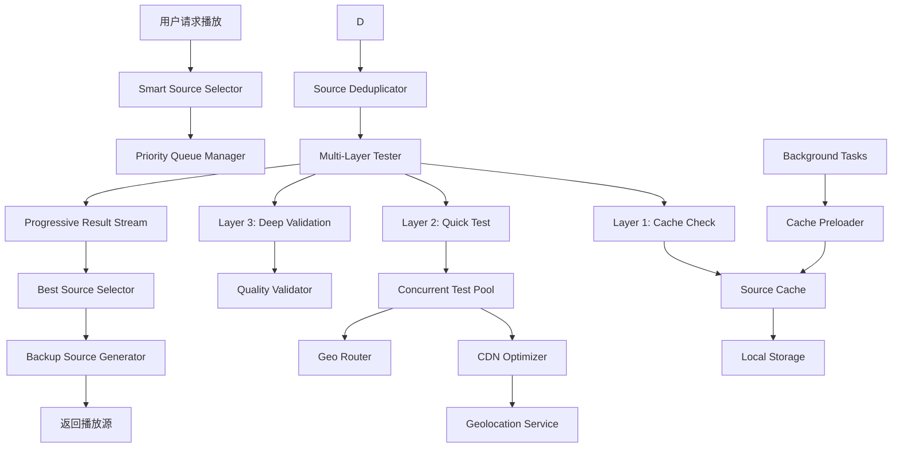

# Design Document

## Overview

本设计文档描述了播放器智能搜索源算法优化的技术方案。该优化方案通过改进现有的 `fast-source-tester.ts`、`cdn-optimizer.ts`、`source-cache.ts` 和 `backup-source-manager.ts` 模块，实现更快速、更智能的播放源选择机制。

核心优化策略包括：

1. **并行化测试流程** - 优化并发控制和批处理逻辑
2. **智能缓存预热** - 提前缓存热门播放源
3. **自适应超时策略** - 根据网络状况动态调整超时时间
4. **优先级队列** - 基于历史数据优先测试高质量源
5. **渐进式返回** - 边测试边返回可用源，无需等待全部完成

6. **分层测试策略** - 缓存检查 → 快速测试 → 深度验证
7. **智能去重与聚合** - 识别相同源的不同 URL，避免重复测试
8. **地域感知路由** - 基于用户地理位置智能选择最优源
9. **失败快速回退** - 快速识别失败源，立即切换到备用源
10. **预测性预加载** - 预测用户可能播放的内容，提前测试源
11. **动态负载均衡** - 根据源的负载情况动态调整选择策略

## Architecture

### 系统架构图



### 数据流

1. **请求阶段**：用户请求播放 → 检查缓存 → 构建优先级队列
2. **测试阶段**：并发快速测试 → CDN 优化 → 实时评分
3. **选择阶段**：渐进式返回 → 选择最佳源 → 生成备用源
4. **缓存阶段**：更新缓存 → 更新健康度 → 持久化存储

## Components and Interfaces

### 1. Smart Source Selector（智能源选择器）

**职责**：协调整个源选择流程，提供统一的 API 接口

**接口定义**：

```typescript
interface SmartSourceSelector {
  /**
   * 智能选择最佳播放源（渐进式返回）
   * @param sources 候选播放源列表
   * @param options 选择选项
   * @returns 异步迭代器，逐步返回可用源
   */
  selectSourcesProgressive(
    sources: SourceCandidate[],
    options: SelectionOptions
  ): AsyncIterableIterator<SourceResult>;

  /**
   * 快速选择单个可用源
   * @param sources 候选播放源列表
   * @returns 第一个可用的播放源
   */
  selectFirstAvailable(
    sources: SourceCandidate[]
  ): Promise<SourceResult | null>;

  /**
   * 批量选择多个最佳源
   * @param sources 候选播放源列表
   * @param maxResults 最大返回数量
   * @returns 按评分排序的播放源列表
   */
  selectBestSources(
    sources: SourceCandidate[],
    maxResults: number
  ): Promise<SourceResult[]>;
}

interface SourceCandidate {
  source: any;
  episodeUrl: string;
  priority?: number; // 初始优先级
}

interface SelectionOptions {
  mode: 'fast' | 'balanced' | 'comprehensive'; // 选择模式
  enableCDN: boolean; // 是否启用CDN优化
  enableCache: boolean; // 是否使用缓存
  timeout: number; // 超时时间
  maxConcurrency: number; // 最大并发数
}

interface SourceResult {
  source: any;
  episodeUrl: string;
  optimizedUrl?: string;
  score: number;
  pingTime: number;
  available: boolean;
  cdnOptimized: boolean;
  fromCache: boolean;
}
```

### 2. Priority Queue Manager（优先级队列管理器）

**职责**：基于历史数据和缓存信息构建测试优先级队列

**核心算法**：

```typescript
interface PriorityQueueManager {
  /**
   * 构建优先级队列
   * @param sources 原始播放源列表
   * @returns 按优先级排序的播放源队列
   */
  buildQueue(sources: SourceCandidate[]): PriorityQueue<SourceCandidate>;

  /**
   * 计算播放源的初始优先级
   * @param source 播放源
   * @returns 优先级分数（0-100）
   */
  calculatePriority(source: SourceCandidate): number;
}

// 优先级计算公式
function calculatePriority(source: SourceCandidate): number {
  const cached = sourceCache.getCachedSource(source.episodeUrl);

  if (!cached) {
    return 50; // 默认中等优先级
  }

  // 基于历史数据计算优先级
  const healthScore = cached.healthScore * 40; // 健康度权重40%
  const speedScore = getSpeedScore(cached.testResult.pingTime) * 30; // 速度权重30%
  const freshnessScore = getFreshnessScore(cached.lastTestTime) * 20; // 新鲜度权重20%
  const successRateScore = cached.testResult.successRate * 10; // 成功率权重10%

  return healthScore + speedScore + freshnessScore + successRateScore;
}
```

### 3. Enhanced Fast Source Tester（增强型快速源测试器）

**职责**：执行高效的并发源测试，支持渐进式结果返回

**优化点**：

1. **自适应超时**：根据网络状况动态调整超时时间
2. **智能批处理**：根据源的优先级动态调整批次大小
3. **早期终止**：找到足够数量的可用源后提前终止测试

**接口定义**：

```typescript
interface EnhancedFastSourceTester {
  /**
   * 渐进式批量测试（边测试边返回结果）
   * @param sources 播放源队列
   * @param options 测试选项
   * @returns 异步迭代器，实时返回测试结果
   */
  testSourcesProgressive(
    sources: PriorityQueue<SourceCandidate>,
    options: TestOptions
  ): AsyncIterableIterator<TestResult>;

  /**
   * 自适应超时测试
   * @param url 播放源URL
   * @returns 测试结果
   */
  testWithAdaptiveTimeout(url: string): Promise<TestResult>;

  /**
   * 获取当前网络状况
   * @returns 网络质量评估
   */
  getNetworkQuality(): NetworkQuality;
}

interface TestOptions {
  maxConcurrency: number;
  baseTimeout: number;
  earlyTermination: boolean; // 是否启用早期终止
  minAvailableSources: number; // 早期终止的最小可用源数量
}

interface NetworkQuality {
  rtt: number; // 往返时间
  downlink: number; // 下行带宽
  effectiveType: string; // 网络类型
  quality: 'excellent' | 'good' | 'fair' | 'poor';
}

// 自适应超时算法
function calculateAdaptiveTimeout(
  baseTimeout: number,
  networkQuality: NetworkQuality
): number {
  const qualityMultipliers = {
    excellent: 0.7,
    good: 1.0,
    fair: 1.5,
    poor: 2.0,
  };

  const multiplier = qualityMultipliers[networkQuality.quality];
  return Math.min(baseTimeout * multiplier, 5000); // 最大5秒
}
```

### 4. Smart Cache Preloader（智能缓存预热器）

**职责**：在后台预热热门播放源的缓存

**策略**：

1. **热门源识别**：基于访问频率识别热门播放源
2. **后台预热**：在空闲时间预先测试热门源
3. **缓存刷新**：定期刷新即将过期的缓存

**接口定义**：

```typescript
interface SmartCachePreloader {
  /**
   * 启动缓存预热
   */
  startPreloading(): void;

  /**
   * 停止缓存预热
   */
  stopPreloading(): void;

  /**
   * 添加热门播放源
   * @param url 播放源URL
   */
  addHotSource(url: string): void;

  /**
   * 获取预热统计
   */
  getPreloadStats(): PreloadStats;
}

interface PreloadStats {
  totalPreloaded: number;
  cacheHitRate: number;
  averagePreloadTime: number;
}
```

### 5. Progressive Result Stream（渐进式结果流）

**职责**：管理测试结果的实时流式返回

**实现方式**：使用 AsyncIterableIterator 实现流式返回

```typescript
async function* testSourcesProgressive(
  sources: PriorityQueue<SourceCandidate>,
  options: TestOptions
): AsyncIterableIterator<TestResult> {
  const results: TestResult[] = [];
  let availableCount = 0;

  while (!sources.isEmpty()) {
    // 取出一批高优先级源
    const batch = sources.dequeueBatch(options.maxConcurrency);

    // 并发测试
    const batchPromises = batch.map((source) =>
      this.testWithAdaptiveTimeout(source.episodeUrl)
    );

    // 使用 Promise.race 实现实时返回
    for (const promise of batchPromises) {
      const result = await promise;
      results.push(result);

      if (result.available) {
        availableCount++;
        yield result; // 立即返回可用源

        // 早期终止检查
        if (
          options.earlyTermination &&
          availableCount >= options.minAvailableSources
        ) {
          return;
        }
      }
    }
  }

  // 返回所有不可用的源（用于备用）
  for (const result of results) {
    if (!result.available) {
      yield result;
    }
  }
}
```

### 6. Source Deduplicator（源去重器）

**职责**：识别和去除重复的播放源 URL

**策略**：

```typescript
interface SourceDeduplicator {
  /**
   * 去重播放源列表
   * @param sources 原始播放源列表
   * @returns 去重后的播放源列表
   */
  deduplicate(sources: SourceCandidate[]): SourceCandidate[];

  /**
   * 检查两个URL是否指向同一个源
   * @param url1 第一个URL
   * @param url2 第二个URL
   * @returns 是否为同一个源
   */
  isSameSource(url1: string, url2: string): boolean;
}

// URL规范化和去重算法
function deduplicate(sources: SourceCandidate[]): SourceCandidate[] {
  const seen = new Map<string, SourceCandidate>();

  sources.forEach((source) => {
    const normalizedUrl = normalizeUrl(source.episodeUrl);

    if (!seen.has(normalizedUrl)) {
      seen.set(normalizedUrl, source);
    } else {
      // 如果已存在，保留优先级更高的
      const existing = seen.get(normalizedUrl)!;
      if ((source.priority || 0) > (existing.priority || 0)) {
        seen.set(normalizedUrl, source);
      }
    }
  });

  return Array.from(seen.values());
}

function normalizeUrl(url: string): string {
  try {
    const urlObj = new URL(url);
    // 移除查询参数中的时间戳和随机参数
    urlObj.searchParams.delete('t');
    urlObj.searchParams.delete('r');
    urlObj.searchParams.delete('_');
    // 统一协议为https
    urlObj.protocol = 'https:';
    return urlObj.toString();
  } catch {
    return url;
  }
}
```

### 7. Multi-Layer Tester（分层测试器）

**职责**：实现三层测试策略，逐步验证播放源质量

**测试层级**：

```typescript
interface MultiLayerTester {
  /**
   * 执行分层测试
   * @param url 播放源URL
   * @returns 测试结果
   */
  testInLayers(url: string): Promise<LayeredTestResult>;
}

interface LayeredTestResult {
  layer1: CacheCheckResult; // 缓存检查
  layer2?: QuickTestResult; // 快速测试
  layer3?: DeepValidationResult; // 深度验证
  finalScore: number;
  available: boolean;
}

// 分层测试流程
async function testInLayers(url: string): Promise<LayeredTestResult> {
  const result: LayeredTestResult = {
    layer1: await checkCache(url),
    finalScore: 0,
    available: false,
  };

  // Layer 1: 缓存检查
  if (result.layer1.hit && result.layer1.fresh) {
    result.finalScore = result.layer1.cachedScore;
    result.available = result.layer1.cachedAvailable;
    return result; // 缓存命中且新鲜，直接返回
  }

  // Layer 2: 快速测试（HEAD请求）
  result.layer2 = await quickTest(url);
  if (!result.layer2.available) {
    result.available = false;
    result.finalScore = 0;
    return result; // 快速测试失败，无需深度验证
  }

  // Layer 3: 深度验证（可选，仅对高优先级源）
  if (shouldDeepValidate(url)) {
    result.layer3 = await deepValidate(url);
    result.finalScore = calculateFinalScore(result.layer2, result.layer3);
    result.available = result.layer3.available;
  } else {
    result.finalScore = result.layer2.score;
    result.available = result.layer2.available;
  }

  return result;
}
```

### 8. Geo Router（地域路由器）

**职责**：基于用户地理位置智能路由到最优播放源

**路由策略**：

```typescript
interface GeoRouter {
  /**
   * 根据地理位置选择最优源
   * @param sources 候选播放源列表
   * @param userLocation 用户地理位置
   * @returns 按地理距离排序的播放源列表
   */
  routeByLocation(
    sources: SourceCandidate[],
    userLocation: GeolocationInfo
  ): SourceCandidate[];

  /**
   * 计算源与用户的地理距离
   * @param sourceUrl 播放源URL
   * @param userLocation 用户位置
   * @returns 距离（公里）
   */
  calculateDistance(sourceUrl: string, userLocation: GeolocationInfo): number;
}

// 地理距离计算（Haversine公式）
function calculateDistance(
  lat1: number,
  lon1: number,
  lat2: number,
  lon2: number
): number {
  const R = 6371; // 地球半径（公里）
  const dLat = toRad(lat2 - lat1);
  const dLon = toRad(lon2 - lon1);

  const a =
    Math.sin(dLat / 2) * Math.sin(dLat / 2) +
    Math.cos(toRad(lat1)) *
      Math.cos(toRad(lat2)) *
      Math.sin(dLon / 2) *
      Math.sin(dLon / 2);

  const c = 2 * Math.atan2(Math.sqrt(a), Math.sqrt(1 - a));
  return R * c;
}
```

### 9. Predictive Preloader（预测性预加载器）

**职责**：预测用户可能播放的内容，提前测试播放源

**预测策略**：

```typescript
interface PredictivePreloader {
  /**
   * 预测用户下一步可能播放的内容
   * @param currentVideo 当前播放的视频
   * @param userHistory 用户历史记录
   * @returns 预测的视频列表
   */
  predictNextVideos(
    currentVideo: VideoInfo,
    userHistory: VideoInfo[]
  ): VideoInfo[];

  /**
   * 预加载播放源
   * @param videos 预测的视频列表
   */
  preloadSources(videos: VideoInfo[]): Promise<void>;
}

// 简单的预测算法：下一集、相关推荐
function predictNextVideos(
  currentVideo: VideoInfo,
  userHistory: VideoInfo[]
): VideoInfo[] {
  const predictions: VideoInfo[] = [];

  // 1. 如果是连续剧，预测下一集
  if (currentVideo.episodeNumber) {
    predictions.push({
      ...currentVideo,
      episodeNumber: currentVideo.episodeNumber + 1,
    });
  }

  // 2. 基于用户历史的相似内容
  const similarVideos = findSimilarVideos(currentVideo, userHistory);
  predictions.push(...similarVideos.slice(0, 3));

  return predictions;
}
```

## Data Models

### 1. Enhanced Source Test Result

```typescript
interface EnhancedTestResult extends FastTestResult {
  priority: number; // 优先级分数
  networkQuality: NetworkQuality; // 测试时的网络状况
  adaptiveTimeout: number; // 实际使用的超时时间
  testAttempts: number; // 测试尝试次数
  fromCache: boolean; // 是否来自缓存
  cacheAge: number; // 缓存年龄（毫秒）

  geoDistance?: number; // 地理距离（公里）
  layerResults?: LayeredTestResult; // 分层测试结果
}
```

### 2. Source Priority Score

```typescript
interface SourcePriorityScore {
  url: string;
  totalScore: number; // 总分（0-100）
  healthScore: number; // 健康度分数
  speedScore: number; // 速度分数
  freshnessScore: number; // 新鲜度分数
  successRateScore: number; // 成功率分数
  cdnBonus: number; // CDN优化加分

  geoBonus: number; // 地理位置加分
  calculatedAt: number; // 计算时间戳
}
```

### 3. Network Quality Metrics

```typescript
interface NetworkQualityMetrics {
  rtt: number; // 往返时间（ms）
  downlink: number; // 下行带宽（Mbps）
  effectiveType: '4g' | '3g' | '2g' | 'slow-2g';
  quality: 'excellent' | 'good' | 'fair' | 'poor';
  measuredAt: number; // 测量时间戳
}
```

### 4. Layered Test Result

```typescript
interface LayeredTestResult {
  layer1: CacheCheckResult; // 缓存检查结果
  layer2?: QuickTestResult; // 快速测试结果
  layer3?: DeepValidationResult; // 深度验证结果
  finalScore: number; // 最终评分
  available: boolean; // 是否可用
  testDuration: number; // 测试耗时（ms）
}

interface CacheCheckResult {
  hit: boolean; // 是否命中缓存
  fresh: boolean; // 缓存是否新鲜
  cachedScore: number; // 缓存的评分
  cachedAvailable: boolean; // 缓存的可用性
  cacheAge: number; // 缓存年龄（ms）
}

interface QuickTestResult {
  available: boolean; // 是否可用
  pingTime: number; // 延迟时间（ms）
  score: number; // 快速测试评分
  statusCode?: number; // HTTP状态码
}

interface DeepValidationResult {
  available: boolean; // 是否可用
  bandwidth: number; // 带宽（Mbps）
  quality: string; // 视频质量
  loadSpeed: string; // 加载速度
  score: number; // 深度验证评分
}
```

## Error Handling

### 1. 测试失败处理

```typescript
class SourceTestError extends Error {
  constructor(
    public url: string,
    public reason: 'timeout' | 'network' | 'cors' | 'unknown',
    public originalError?: Error
  ) {
    super(`Source test failed: ${url} - ${reason}`);
  }
}

// 错误处理策略
async function handleTestError(
  error: SourceTestError,
  source: SourceCandidate
): Promise<TestResult> {
  // 记录错误
  console.warn(`Source test error: ${error.url}`, error);

  // 更新缓存（标记为不可用）
  sourceCache.updateCache(error.url, {
    quality: '未知',
    loadSpeed: '未知',
    pingTime: 0,
    hasError: true,
    testTime: Date.now(),
    successRate: 0,
  });

  // 返回失败结果
  return {
    url: error.url,
    available: false,
    pingTime: 0,
    score: 0,
    testTime: Date.now(),
    error: error.reason,
  };
}
```

### 2. 网络异常处理

- **超时处理**：使用 AbortController 实现请求超时
- **重试机制**：对于网络波动导致的失败，自动重试 1 次
- **降级策略**：当所有源都失败时，返回原始源列表供用户手动选择

### 3. 缓存异常处理

- **存储失败**：捕获 localStorage 异常，降级为内存缓存
- **数据损坏**：检测到缓存数据损坏时，清空缓存重新开始
- **容量限制**：达到存储限制时，清理最旧的缓存条目

## Testing Strategy

### 1. 单元测试

**测试目标**：

- Priority Queue Manager 的优先级计算逻辑
- Adaptive Timeout 的超时时间计算
- Cache Preloader 的热门源识别算法
- Progressive Result Stream 的流式返回逻辑

**测试框架**：Jest

**示例测试用例**：

```typescript
describe('PriorityQueueManager', () => {
  it('should calculate priority based on health score', () => {
    const source = createMockSource();
    const priority = priorityQueueManager.calculatePriority(source);
    expect(priority).toBeGreaterThan(0);
    expect(priority).toBeLessThanOrEqual(100);
  });

  it('should prioritize cached sources with high health score', () => {
    const cachedSource = createMockCachedSource({ healthScore: 0.9 });
    const uncachedSource = createMockSource();

    const cachedPriority = priorityQueueManager.calculatePriority(cachedSource);
    const uncachedPriority =
      priorityQueueManager.calculatePriority(uncachedSource);

    expect(cachedPriority).toBeGreaterThan(uncachedPriority);
  });
});
```

### 2. 集成测试

**测试目标**：

- Smart Source Selector 与各组件的集成
- 端到端的源选择流程
- CDN 优化与源测试的协同工作

**测试场景**：

1. 正常场景：所有源都可用
2. 部分失败：部分源不可用
3. 全部失败：所有源都不可用
4. 缓存命中：使用缓存的测试结果
5. 网络波动：模拟网络不稳定情况

### 3. 性能测试

**测试指标**：

- 首个可用源返回时间（目标：< 500ms）
- 完整测试完成时间（目标：< 2s）
- 缓存命中率（目标：> 70%）
- 并发测试吞吐量（目标：> 10 sources/s）

**测试工具**：

- Performance API 测量时间
- Chrome DevTools 分析网络请求
- 自定义性能监控工具

### 4. 压力测试

**测试场景**：

- 大量播放源（100+）的批量测试
- 高并发用户同时请求
- 网络延迟和丢包模拟

## Advanced Optimization Algorithms

### 1. 智能并发控制算法

**动态并发数计算**：

```typescript
function calculateOptimalConcurrency(
  networkQuality: NetworkQuality,
  sourceCount: number
): number {
  // 基础并发数
  let baseConcurrency = 6;

  // 根据网络质量调整
  switch (networkQuality.quality) {
    case 'excellent':
      baseConcurrency = 10;
      break;
    case 'good':
      baseConcurrency = 8;
      break;
    case 'fair':
      baseConcurrency = 4;
      break;
    case 'poor':
      baseConcurrency = 2;
      break;
  }

  // 根据源数量调整（避免过度并发）
  const optimalConcurrency = Math.min(
    baseConcurrency,
    Math.ceil(sourceCount / 2)
  );

  return Math.max(2, optimalConcurrency); // 最少2个并发
}
```

### 2. 自适应缓存过期策略

**动态过期时间计算**：

```typescript
function calculateCacheExpiry(healthScore: number, testCount: number): number {
  const BASE_EXPIRY = 10 * 60 * 1000; // 10分钟基准

  // 健康度越高，缓存时间越长
  let multiplier = 1.0;
  if (healthScore > 0.8) {
    multiplier = 3.0; // 30分钟
  } else if (healthScore > 0.5) {
    multiplier = 1.5; // 15分钟
  } else if (healthScore < 0.3) {
    multiplier = 0.5; // 5分钟
  }

  // 测试次数越多，数据越可靠，缓存时间可以更长
  const reliabilityBonus = Math.min(testCount / 10, 1.0);
  multiplier *= 1 + reliabilityBonus * 0.5;

  return Math.round(BASE_EXPIRY * multiplier);
}
```

### 3. 智能评分算法

**综合评分计算**：

```typescript
function calculateComprehensiveScore(
  testResult: EnhancedTestResult,
  geoDistance: number,
  cdnOptimized: boolean
): number {
  let score = 0;

  // 1. 基础可用性评分（40%）
  if (testResult.available) {
    score += 40;
  }

  // 2. 延迟评分（25%）
  const pingScore = calculatePingScore(testResult.pingTime);
  score += pingScore * 0.25;

  // 3. 健康度评分（15%）
  const healthScore = testResult.healthScore || 0.5;
  score += healthScore * 15;

  // 4. 地理位置评分（10%）
  const geoScore = calculateGeoScore(geoDistance);
  score += geoScore * 0.1;

  // 5. CDN优化加分（10%）
  if (cdnOptimized) {
    score += 10;
  }

  return Math.min(100, Math.max(0, score));
}

function calculatePingScore(pingTime: number): number {
  if (pingTime <= 0) return 0;
  if (pingTime <= 100) return 100;
  if (pingTime <= 200) return 90;
  if (pingTime <= 500) return 70;
  if (pingTime <= 1000) return 50;
  if (pingTime <= 2000) return 30;
  return 10;
}

function calculateGeoScore(distance: number): number {
  if (distance <= 0) return 100;
  if (distance <= 500) return 100;
  if (distance <= 1000) return 80;
  if (distance <= 2000) return 60;
  if (distance <= 5000) return 40;
  return 20;
}
```

### 4. 早期终止优化

**智能终止条件**：

```typescript
function shouldTerminateEarly(
  availableSources: SourceResult[],
  totalSources: number,
  testedCount: number,
  mode: 'fast' | 'balanced' | 'comprehensive'
): boolean {
  // 快速模式：找到1个可用源即可
  if (mode === 'fast' && availableSources.length >= 1) {
    return true;
  }

  // 平衡模式：找到3个高质量源或测试了50%的源
  if (mode === 'balanced') {
    const highQualitySources = availableSources.filter((s) => s.score > 70);
    if (highQualitySources.length >= 3) return true;
    if (testedCount >= totalSources * 0.5 && availableSources.length >= 2) {
      return true;
    }
  }

  // 全面模式：测试所有源
  return false;
}
```

### 5. 负载均衡算法

**源负载评估**：

```typescript
interface SourceLoadMetrics {
  url: string;
  activeConnections: number;
  recentFailures: number;
  avgResponseTime: number;
  lastUsedTime: number;
}

function selectSourceWithLoadBalancing(
  sources: SourceResult[],
  loadMetrics: Map<string, SourceLoadMetrics>
): SourceResult {
  // 计算每个源的负载评分
  const scoredSources = sources.map((source) => {
    const metrics = loadMetrics.get(source.episodeUrl);
    let loadScore = source.score;

    if (metrics) {
      // 活跃连接数惩罚
      loadScore -= metrics.activeConnections * 5;

      // 最近失败惩罚
      loadScore -= metrics.recentFailures * 10;

      // 响应时间惩罚
      if (metrics.avgResponseTime > 1000) {
        loadScore -= 20;
      }

      // 最近使用时间加分（避免过度集中）
      const timeSinceLastUse = Date.now() - metrics.lastUsedTime;
      if (timeSinceLastUse > 60000) {
        // 超过1分钟未使用
        loadScore += 10;
      }
    }

    return { source, loadScore };
  });

  // 选择负载评分最高的源
  scoredSources.sort((a, b) => b.loadScore - a.loadScore);
  return scoredSources[0].source;
}
```

## Performance Optimization

### 1. 并发控制优化

**当前问题**：固定并发数（6 个）可能不适合所有场景

**优化方案**：

- 根据网络质量动态调整并发数
- 优秀网络：8-10 个并发
- 良好网络：6 个并发
- 一般网络：4 个并发
- 较差网络：2 个并发

### 2. 缓存策略优化

**当前问题**：缓存过期时间固定（10 分钟）

**优化方案**：

- 基于健康度的动态过期时间
- 高健康度源：30 分钟
- 中健康度源：10 分钟
- 低健康度源：5 分钟

### 3. 请求优化

**优化措施**：

- 使用 HTTP/2 多路复用
- 启用 Keep-Alive 连接复用
- 压缩请求头
- 使用 DNS 预解析

### 4. 内存优化

**优化措施**：

- 限制缓存大小（最多 1000 条）
- 使用 WeakMap 存储临时数据
- 及时清理过期缓存
- 避免内存泄漏

### 5. 批处理优化

**优化策略**：

- 优先级分组：将源按优先级分为高、中、低三组
- 高优先级组优先测试，使用更多并发
- 中优先级组次之
- 低优先级组最后测试，可选择性跳过

### 6. 预测性优化

**优化措施**：

- 基于用户行为预测下一步操作
- 提前预加载可能需要的播放源
- 利用空闲时间进行后台测试
- 智能预热热门内容的播放源

## Implementation Phases

### Phase 1: 核心优化（优先级最高）

1. 实现 Priority Queue Manager
2. 优化 Fast Source Tester 的并发控制
3. 实现自适应超时机制
4. 添加性能监控和日志

### Phase 2: 渐进式返回（优先级高）

1. 实现 Progressive Result Stream
2. 修改 Smart Source Selector 支持流式返回
3. 实现早期终止机制
4. 更新前端调用代码

### Phase 3: 智能缓存（优先级中）

1. 实现 Smart Cache Preloader
2. 优化缓存过期策略
3. 实现热门源识别
4. 添加缓存统计和监控

### Phase 4: 高级特性（优先级低）

1. 实现网络质量检测
2. 优化 CDN 选择算法
3. 添加 A/B 测试支持
4. 实现用户偏好学习

## Monitoring and Metrics

### 关键指标

1. **性能指标**

   - 首个可用源返回时间（P50, P95, P99）
   - 完整测试完成时间（P50, P95, P99）
   - 并发测试吞吐量

2. **质量指标**

   - 源可用率
   - 缓存命中率
   - CDN 优化率
   - 测试成功率

3. **用户体验指标**
   - 播放启动时间
   - 播放失败率
   - 源切换次数

### 监控实现

```typescript
interface PerformanceMetrics {
  firstSourceTime: number; // 首个源返回时间
  totalTestTime: number; // 总测试时间
  sourcesTestedCount: number; // 测试的源数量
  availableSourcesCount: number; // 可用源数量
  cacheHitCount: number; // 缓存命中次数
  cdnOptimizedCount: number; // CDN优化的源数量
  timestamp: number;
}

class PerformanceMonitor {
  private metrics: PerformanceMetrics[] = [];

  recordMetrics(metrics: PerformanceMetrics): void {
    this.metrics.push(metrics);
    this.reportToAnalytics(metrics);
  }

  getAverageMetrics(): PerformanceMetrics {
    // 计算平均值
  }

  private reportToAnalytics(metrics: PerformanceMetrics): void {
    // 上报到分析平台
    console.log('[Performance]', metrics);
  }
}
```

## Security Considerations

1. **CORS 处理**：正确处理跨域请求，避免暴露敏感信息
2. **URL 验证**：验证播放源 URL 的合法性，防止 SSRF 攻击
3. **缓存安全**：避免缓存敏感信息，定期清理缓存
4. **请求限流**：限制测试请求频率，避免被视为攻击
5. **错误信息**：避免在错误信息中暴露系统内部细节
